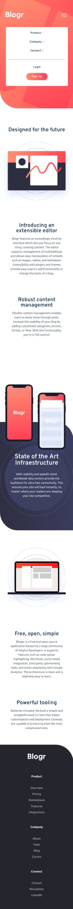

# Blogr-landing-page
Landing page para um blog

Uma Landing page para uma rede social fictícia - Blogr

## DETALHES DO PROJETO:
O Objetivo principal do projeto foi desenvolver uma landing page
para uma rede social fictícia de nome Blogr.
O JavaScrip foi utilizado apenas para o menu do tipo hambuerger.

## Disponível apenas para mobile!!
Oriento abrir o link do projeto final em um celular ou no desktop 
através da ferramenta de desenvolvedor e mudar a opção de tela para mobile.

## Status do Projeto

:construction:Em construção!:construction:  
A versão para desktop ainda está sendo desenvolvida!
Algumas funcionalidades nos menus ainda precisam ser reformuladas e
as animações refeitas.

## Foto do Projeto para mobile
 

## TECNOLOGIAS USADAS NO PROJETO:
* HTML
* CSS
* JavaScript
